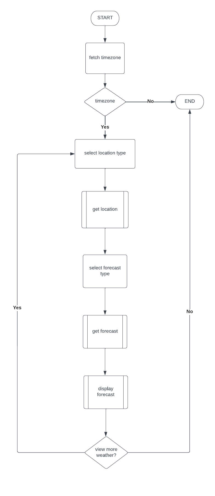
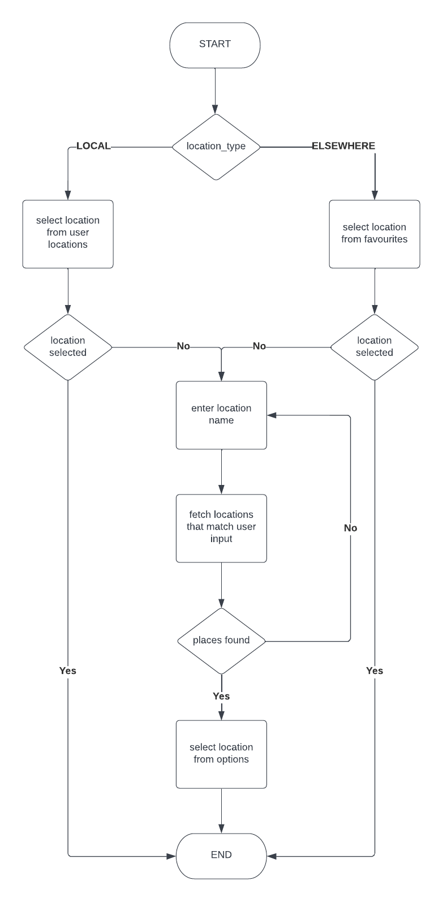
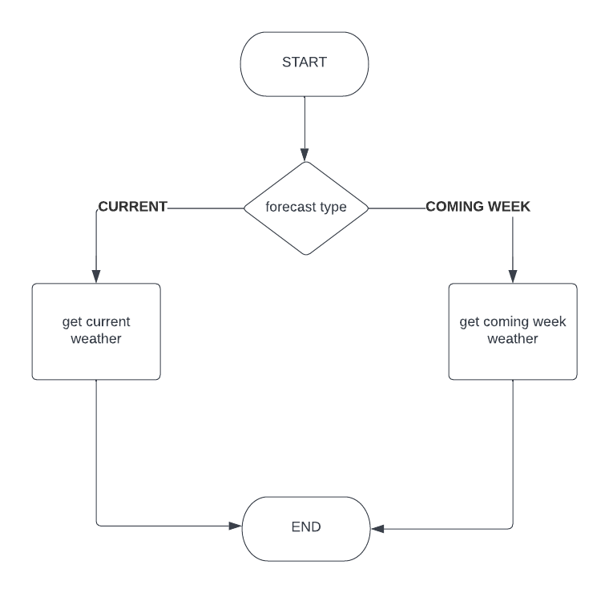
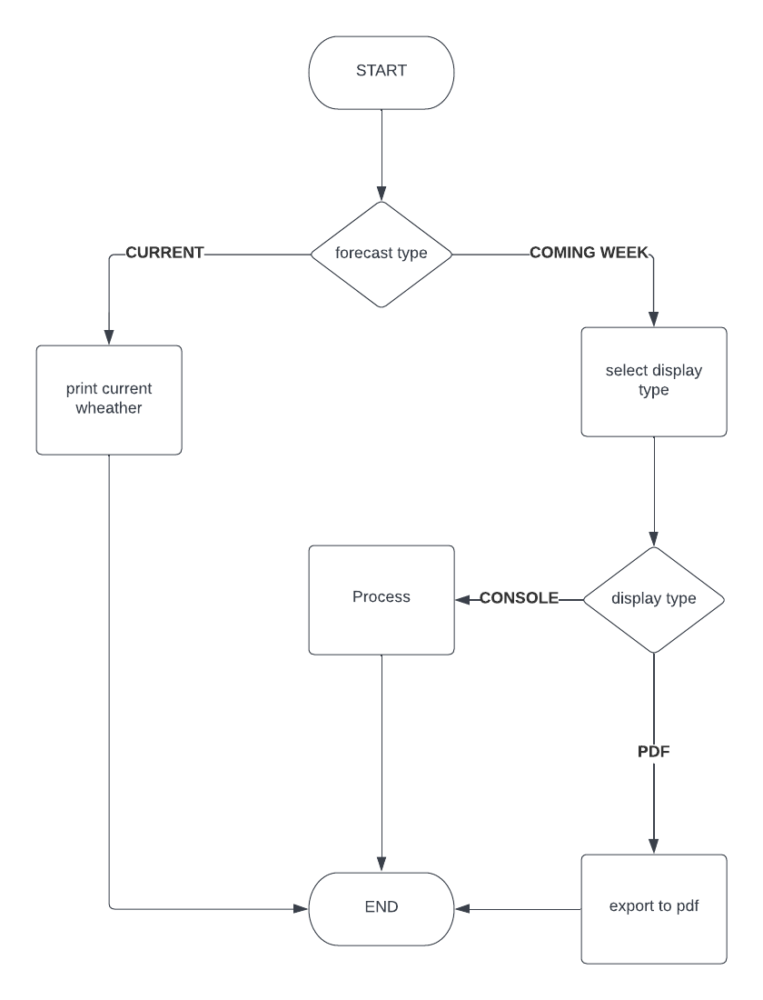

# CLIMate - a weather app

**CLIMate** is a command line weather forecasting application that I created as
the third assessment piece for my CoderAcademy studies. It enables its
users to search for any valid location around the globe by place name,
and can then be used to fetch current or weekly forecast data for
that place - based on the place's latitude and longitude.

## APIs Used

This app has made use of the following free APIs^:

- WorldTimeAPI : [http://worldtimeapi.org](http://worldtimeapi.org)
- Nominatim : [https://nominatim.org](https://nominatim.org)
- Open-Meteo : [https://open-meteo.com](https://open-meteo.com)

^*None of these APIs require a key*.

**WorldTimeAPI** has been used for determining the users' timezone when
running the application.

**Nomination** has been used for fetching geolocation data by place name.

**Open-Meteo** has been used for fetching current and weekly weather forecast
data for a given latitude and longitude.

## Source Control Repository

The code for this project can be found at 
[https://github.com/robocoptertron/RobertNeville_T1A3](https://github.com/robocoptertron/RobertNeville_T1A3).

## Coding Style Guide

This project has been written with the Airbnb Ruby Style Guide in mind.
In some cases, the maximum line length of 100 characters has been voilated 
by less than 10% to facilitate readability.

The Airbnb Ruby Style Guide can be found at 
[https://github.com/airbnb/ruby](https://github.com/airbnb/ruby).

## Application Features

CLIMate combines the following high-level features into a cohesive weather
forecasting service:

1. It integrates place name search functionality, enabling users to choose
from a list of places found to match their query.
2. Users can view current weather conditions for their chosen place name.
3. Users can view weekly weather forecasts for their chosen place name.
4. Users can save current or weekly weather data in their history for
later reference (perusable by starting the app with it's `--history`
command line option).
5. A user's current location can be cached to 'user locations' for 
convenience and faster app performance.
6. Arbitraty locations can be saved to the user's 'favourites' for 
convenience and faster app performance.
7. It offers a PDF export option for weekly weather forecasts (the user's
exports directory can be easily configured during app setup, or via use
of the `--config` command line option).

These features have been implemented with comprehensive use of Ruby
programming constructs.

## Implementation Plan

### Overview

CLIMate will be implemented with an object oriented approach. The primary 
application logic will be contained in an `App` class, and a `ConfigManager`
class will be created to handle the app's configuration. These two
classes will be instantiated in the app's entry point `main.rb`, wherein
initial command line argument processing will also take place. 

The constructor
for `App` will take a `ConfigManager` object as its only argument, and
will include an `exec` function to initiate the program's primary logic.
This function will operate on the command line arguments passed to the 
program, and will determine weather the user will interact with the
main CLIMate loop or the history or config subsystems.

A Bash script will be written to handle application setup - to install
all dependencies, create the configuration directory, 
and launch the app if the user so desires. The configuration directory
will contain the following four JSON configuration files, which will
be initialised with default content by the setup script:

1. `config.json`
2. `locations.json`
3. `favourites.json`
4. `history.json`

These files will store the app's general configuration, the user's
saved and favourite locations, and their forecast history, respectively.

The user will also have the option to specify the directory to be used for
PDF exports when following the setup procedure (this can also be changed
after setup by launching the app with the `--config` option and 
the `set` argument).

All API related methods will be implemented in separate modules - each 
pertaining to the one API.

### ArgumentParser

Prior to the commencement of this project, I was working on re-writing
a command line argument parser class, that I had partially implemented in
C++. I thought I might be able to use it in this project.

I discovered a Ruby gem available called `optparse` that can be used to parse
command line arguments. However, after experimentation with the package,
I decided that I would finish the custom argument parser that I was developing; 
`optparse` was not well documented and awkward to use.

CLIMate will include the custom '`ArgumentParser`' class.

### Flowcharts for `App` class `main_loop` method

#### main_loop method

#### 'get location' subprocess

#### 'get weather' subprocess

#### 'display forecast' subprocess

### App Implementation Steps

The first step in the development of CLIMate will involve creating 
`setup.sh`. As discussed in the Overview section earlier, this script
will handle the creation of the configuration directory and it's 
contained JSON files - initialising these files with default 
configuration values.

After this script has been implemented, the `ConfigManager` class
will be written. This class will provide the logic of the
configuration system and will be required to be at least partially
implemented before the `App` class.

Another class that needs to be finished before the `App` class is
`ArgumentParser`. When this class is fully functional, then the
the `exec` method of `App` can be worked on.

The `App` class and all other modules will be implemented progressively
once `ConfigManager` and `ArgumentParser` are complete - as the 
`main_loop` method of `App` is formulated.

It is important to note here that for the preliminary stages of
the development of `ConfigManager` and `ArgumentParser`, the `main.rb`
file (the app's main entry point) will be used for testing. When
these two classes are complete, the app's bootstrap logic can be
written and a call the `exec` method of `App` (with the parsed
command line argumets as its argument) can be added as
the final statement so that the `App` class can be tested as it 
is implemented.

Regarding the features of the app's primary logic, all necessary
methods will be implemented in sequence according to the
flowcharts detailed above - the API methods will be created
as required when the associated logic in `main_loop` is being
worked on.

All features outlined in the above flowchart will be implmented
as methods of the `App` class, with API calls handled by the methods
defined in the respective modules.

Following the logic outlined in the `main_loop` flowchart,
the features of the CLIMate's primary logic will be implemented
in the following order:

1. Work on the 'fetch timezone' process (required for fetching weather 
forecast data through Open-Meteo).

2. Work on the 'select location type' process.

3. Work on the 'get location' subprocess. The course of execution for this
feature will depend on the location type, and will involve the
following functionality:

    - If the location type is "local", check if the user has any saved
    user locations. If so, prompt the user to select one of those locations
    or "somewhere else".

    - If the location type is "elsewhere", check if the user has any saved
    favourites. If so, ask the user if they would like to select from 
    those locations, or search for a new one.

    - If a location is not selected at this point, the user will enter
    a place name search loop. They will exit the loop if they search for
    a valid place name and select one from the list of alternatives.

4. Work on the 'select forecast type' process (required for determining
the type of weather data to fetch in the following step).

5. Work on the 'get forecast' subprocess. This is similar to the
'get location' subprocess in that it is dependent on the forecast type.
It will involve the following functionality:

    - If the forecast type is "current", fetch the current weather
    for the location selected in the 'get location' subprocess.

    - If the forecast type is "coming week", fetch the coming week's
    weather for the location selected in the 'get location' subprocess.
    Ask the user if they would like the data to be displayed in their
    console or exported to a PDF. Complete the display process, by 
    carrying out one of the two options.

6. Work on implemented the history feature - the user will be asked
if they would like to save the weather data fetched to their history, and
do so if they respond with 'yes'.

During the planning stages of this project it is no clear to
me exactly what and how many supporting methods will be required.
These methods will be created on an as-the-need-is-realised basis.

